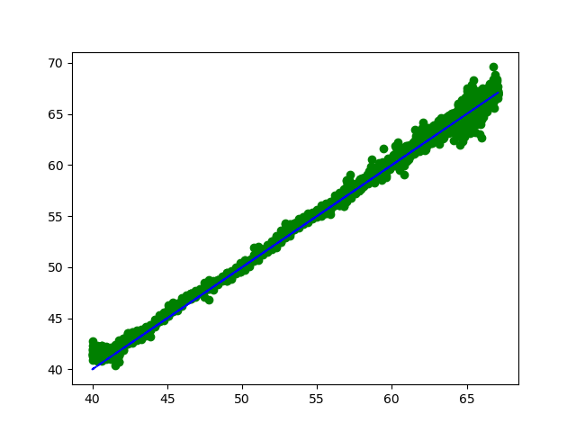

# RedeNeural
codando uma rede neural do zero com numpy :)

# Arquivos

RedeNeural.py -> define a classe CamaLinear e RedeNeural, bem como função de ativação relu e função de erro MSE.

MNIST.py -> utiliza o dataset mnist (importando tensorflow) e treina usando nossa biblioteca customizada.

TEMP.py -> resolve o problema de prever temperaturas de amostras.

Banco de Dados usado tem TEMP.py disponível em: https://file.io/ZW9Qm760RGQj

# Resultados 
Alcançamos acurácia significativa no teste do problema físico. 
A rede, composta somente por camadas lineares, é capaz de prever com precisão a temperatura de materiais nas amostras de teste!

Legenda: [Verdadeiro][Previsão]

Legenda: Desvio das Previsões com relações aos Verdadeiros

# Ideias Futuras

O mecanismo de propagação recursiva em redes neurais possui falhas. É muito fácil construir um treino instável, onde as correções da propagação são grandes demais, causando gradientes que explodem. 
A ideia de aplicar um algoritmo genético na rede neural é muito interessante, porque:
1. A propagação recursiva é substituida por uma seleção natural entre pesos, que, inicializados da maneira correta, não explodem.
2. Algoritmos genéticos podem resolver problemas complexos, pois não dependem do tamanho do banco de dados de forma tão intensa.

