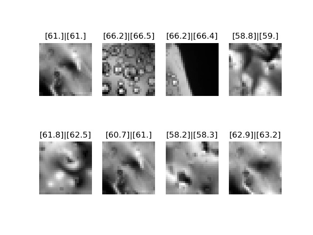

# RedeNeural
codando uma rede neural do zero com numpy :)

# Arquivos

RedeNeural.py -> define a classe CamaLinear e RedeNeural, bem como função de ativação relu e função de erro MSE.

MNIST.py -> utiliza o dataset mnist (importando tensorflow) e treina usando nossa biblioteca customizada.

TEMP.py -> resolve o problema de prever temperaturas de amostras.

Banco de Dados usado tem TEMP.py disponível em: https://file.io/ZW9Qm760RGQj

# Resultados 
Alcançamos acurácia significativa no teste do problema físico. 
A rede, composta somente por camadas lineares, é capaz de prever com precisão a temperatura de materiais nas amostras de teste!

